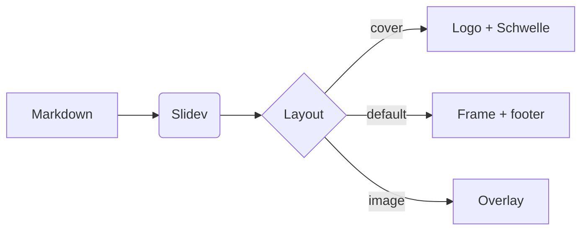

# Das neue DB Design für Slidev

Markdown-Präsentationen im Corporate Design der Deutschen Bahn

Max Mustermann

11 September 2026

---

# What this theme gives you

- **Design tokens** – the complete DB colour palette (Grey, DB Red, Lilac, Green, 25 … 900) as CSS variables
- **Typography** – DB Neo Screen Head for headlines, DB Neo Screen Sans for body copy, 1.1 / 1.3 line heights
- **Schwelle** – rebuilt from the official construction drawings, standard and S variant
- **Logo** – with configurable sender ("Logozusatz"), red or white
- **Layouts** – cover, section, agenda, image, two columns, quote, fact, statement, end …
- **Motion** – DB easing curves for slide transitions, clicks and the Schwelle build-up
- **Dark mode**, classification marker, page numbers, footer and a progress strip

---
layout: agenda
---

# Agenda

1. Design tokens
2. Typography
3. Schwelle and logo
4. Layouts
5. Code and diagrams

---
layout: section
number: "01"
---

# Design tokens

Colours, spacing and motion as CSS variables

---

# Colour palette

<div class="grid grid-cols-4 gap-x-6 gap-y-3 mt-2">
  <div v-for="scale in ['grey', 'red', 'lilac', 'green']" :key="scale">
    <h6 class="!mb-1 capitalize">{{ scale === 'red' ? 'DB Red' : scale }}</h6>
    <div class="flex h-14">
      <div v-for="step in [25, 50, 100, 200, 300, 400, 500, 600, 700, 800, 900]" :key="step"
           class="flex-1" :style="{ background: `var(--db-${scale}-${step})` }" :title="`${scale} ${step}`" />
    </div>
    <div class="flex text-[0.55rem] text-[var(--db-muted)]"><span>25</span><span class="ml-auto">900</span></div>
  </div>
</div>

<div class="grid grid-cols-4 gap-6 mt-6 text-sm">
  <div><div class="h-10" style="background: var(--cold-black)"></div><strong>Cold Black</strong> · Grey 900 · <code>--cold-black</code></div>
  <div><div class="h-10" style="background: var(--db-red)"></div><strong>DB Red</strong> · Red 400 · <code>--db-red</code></div>
  <div><div class="h-10" style="background: var(--lilac)"></div><strong>Lilac</strong> · Lilac 200 · <code>--lilac</code></div>
  <div><div class="h-10" style="background: var(--s-bahn-green)"></div><strong>S-Bahn Green</strong> · Green 500 · <code>--s-bahn-green</code></div>
</div>

<p class="text-sm mt-4">White and Cold Black are the only surface colours. DB Red 500 (<code>--db-red-ui</code>) is the accessible red for links and UI on white, DB Red 400 stays reserved for logo and Schwelle.</p>

---
layout: section
number: "02"
inverted: false
---

# Typography

DB Neo Screen Head and DB Neo Screen Sans

---
layout: two-cols
---

# Headlines

## Second level

### Third level

#### Fourth level

###### Overline in Screen Sans Bold

::right::

# Body copy

Body text is set in DB Neo Screen Sans at 1.3 × line height, headlines in DB Neo Screen Head **Black** at 1.1 ×. Red text is reserved for [links](https://sli.dev) and notes.

> Cold Black is used for headlines only, body copy stays plain Black on White.

| Element | Font | Weight |
| --- | --- | --- |
| Headline | DB Screen Head | 900 |
| Body | DB Screen Sans | 400 / 700 |
| Code | Fira Code | 400 |

Press <kbd>space</kbd> for the next slide.

---
layout: section
number: "03"
---

# Schwelle and logo

The visual frame of every message

---

# Schwelle

The Schwelle is drawn from the official construction: 15 bars whose widths grow from 1 to 15 units while the gaps shrink from 14 to 1, each bar-plus-gap being half the height. The S variant (11 bars) is used below 32 px.

<div class="grid grid-cols-[8rem_1fr] gap-y-6 items-center mt-6">
  <span class="text-sm">standard · red</span>
  <Schwelle variant="standard" height="2rem" color="red" />
  <span class="text-sm">standard · lilac</span>
  <Schwelle variant="standard" height="2rem" color="lilac" />
  <span class="text-sm">s · subtle</span>
  <Schwelle variant="s" height="1.25rem" color="subtle" />
  <span class="text-sm">stretched × 2</span>
  <Schwelle variant="s" height="1.25rem" :stretch="2" />
</div>

```html
<Schwelle variant="standard" height="2rem" color="lilac" :stretch="1.5" animate />
<Schwelle variant="standard" height="3rem" animate="loop" />
```

---
layout: two-cols
---

# Logo

The sender ("Logozusatz") comes from `themeConfig.sender` and can be overridden per instance. The logo is DB Red or White, nothing else.

```yaml
themeConfig:
  sender: Systel
  logoColor: red   # red | white
```

::right::

<div class="flex flex-col gap-8 mt-10">
  <DbLogo height="3rem" />
  <DbLogo height="3rem" additive="InfraGO" />
  <DbLogo height="3rem" additive="" />
  <div class="p-4 self-start" style="background: var(--cold-black)">
    <DbLogo height="3rem" color="white" />
  </div>
</div>

---
layout: section
number: "04"
---

# Layouts

One frame, many stages

---
layout: image
image: https://cover.sli.dev
---

# Text on images

The dark gradient keeps the copy at 4.5:1.

---
layout: image-right
image: https://cover.sli.dev
---

# Image as a panel

The "Flächenmodul als Bildträger": text on white, the image in its own panel with a white Schwelle at its foot.

- `layout: image-right` or `image-left`
- `imageWidth: 45%`

---
layout: quote
---

"Unser Design ist klar und direkt. Wir verzichten auf Unnötiges und setzen den Fokus auf das Wesentliche."

Designprinzip „Entschlossene Klarheit"

---
layout: fact
---

# 15 : 11

bars in the standard and the S variant of the Schwelle

---
layout: statement
---

Nicht die Menge schafft Wiedererkennung, sondern die Konsequenz im Einsatz.

---
layout: two-cols-header
---

# Two columns with a header

::left::

### Left

- The header spans both columns
- Columns share the DB margin as their gap

::right::

### Right

- `::left::` and `::right::` slots
- Same as Slidev's built-in layout

---
layout: section
number: "05"
---

# Code and diagrams

Highlighting and Mermaid in DB colours

---

# Code

Shiki uses two DB themes: Grey 25 surface with Black text in light mode, Grey 800 with White text in dark mode. No rounded corners, no shadows.

```ts {all|1-6|8-12}
interface Schwelle {
  variant: "standard" | "s";
  height: string;
  color: "red" | "white" | "lilac" | "subtle";
  stretch: number; // 1 … 2, never compressed
}

function bars(variant: Schwelle["variant"]): number[] {
  const n = variant === "standard" ? 15 : 11;
  const offset = variant === "standard" ? 0 : 2;
  return Array.from({ length: n }, (_, i) => i + 1 + offset);
}
```

---

# Diagrams



---
layout: end
---

# Vielen Dank

Max Mustermann

DB Systel GmbH
